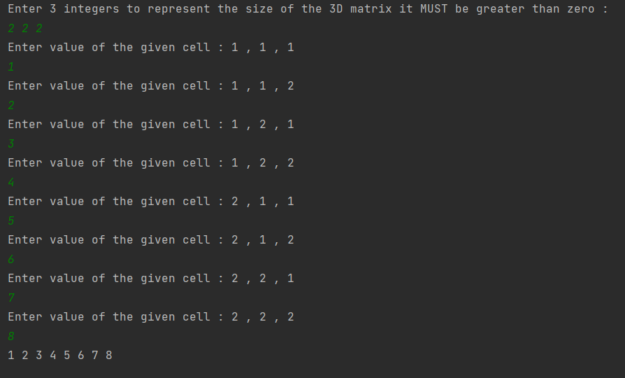
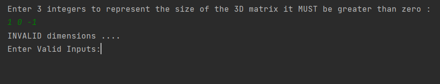

# Matrix-Flatten

## 📙About
A 3D matrix is to be stored in a 1D vector (flattened)
## 🏁Getting Started
```
git clone https://github.com/yousefelmahdy/Matrix-Flatten.git
```
## 💻Built Using
- C++
## 📷Screenshots
### Valid Examples

### ERRORS

### contributors 
[](https://github.com/yousefelmahdy)

